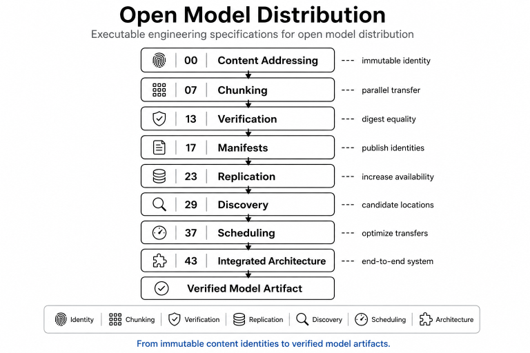

# Open Model Distribution

Executable engineering specifications for distributing large AI artifacts
using immutable content identities, chunking, replication, discovery,
scheduling, and end-to-end verification.

---

<p align="center">
  
</p>

---

## Repository architecture

The notebook series develops a complete engineering pipeline:

```
content

→ content addressing
→ chunking
→ verification
→ manifests
→ replication
→ discovery
→ scheduling
→ integrated architecture

→ verified model artifact
```

Each notebook isolates one engineering responsibility before integrating
the complete open model distribution architecture.

---

## Notebook roadmap

| Notebook | Topic |
|-----------|-------|
| 00 | Content Addressing |
| 07 | Chunking |
| 13 | Verification |
| 17 | Content Manifests |
| 23 | Replication |
| 29 | Discovery |
| 37 | Scheduling |
| 43 | Integrated Architecture |

---

## Run online

| Notebook | Colab |
|----------|-------|
| 00 | https://colab.research.google.com/github/thinkthoughts/open-model-distribution/blob/main/notebooks/00_content_addressing.ipynb |
| 07 | https://colab.research.google.com/github/thinkthoughts/open-model-distribution/blob/main/notebooks/07_chunking.ipynb |
| 13 | https://colab.research.google.com/github/thinkthoughts/open-model-distribution/blob/main/notebooks/13_verification.ipynb |
| 17 | https://colab.research.google.com/github/thinkthoughts/open-model-distribution/blob/main/notebooks/17_content_manifests.ipynb |
| 23 | https://colab.research.google.com/github/thinkthoughts/open-model-distribution/blob/main/notebooks/23_replication.ipynb |
| 29 | https://colab.research.google.com/github/thinkthoughts/open-model-distribution/blob/main/notebooks/29_discovery.ipynb |
| 37 | https://colab.research.google.com/github/thinkthoughts/open-model-distribution/blob/main/notebooks/37_scheduling.ipynb |
| 43 | https://colab.research.google.com/github/thinkthoughts/open-model-distribution/blob/main/notebooks/43_integrated_architecture.ipynb |

---

## Related Lab Reports

These reports summarize the engineering specifications developed throughout
the notebook series.

### Open Model Distribution Demystifies Large AI Artifacts

https://labreports.app/zanoga01/

Introduces the complete content-addressed architecture, including immutable
identities, chunking, replication, discovery, scheduling, and verification.

---

### Verification Specifies Trust in Open Model Distribution

https://labreports.app/zanoga02/

Explains why digest verification remains the invariant throughout chunk
verification, replica selection, scheduling, transfer, reassembly, and final
artifact acceptance.

---

### Notebook Index

https://labreports.app/zanoga/

Browse the complete executable notebook series with figures, equations,
engineering summaries, and Colab links.

---

## Engineering specification

```
identity
    ↓
verification
    ↓
chunking
    ↓
replication
    ↓
discovery
    ↓
scheduling
    ↓
integrated architecture
```

The implementation changes.

The engineering specification persists.
